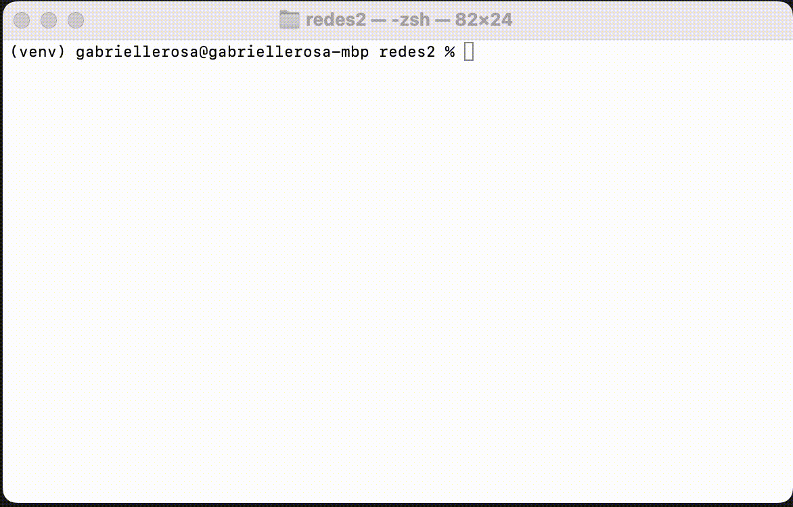
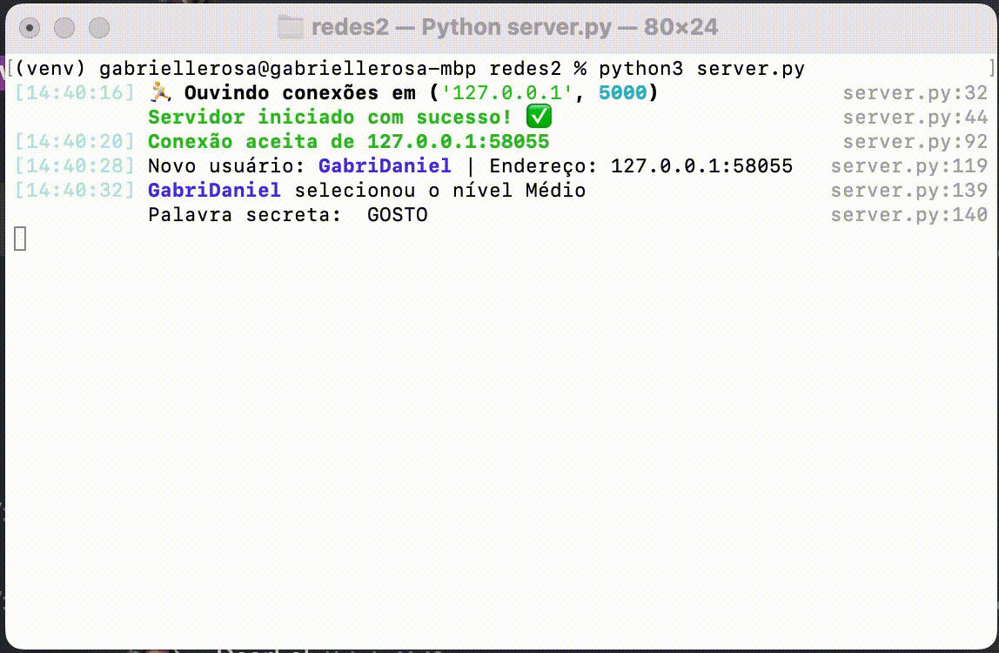
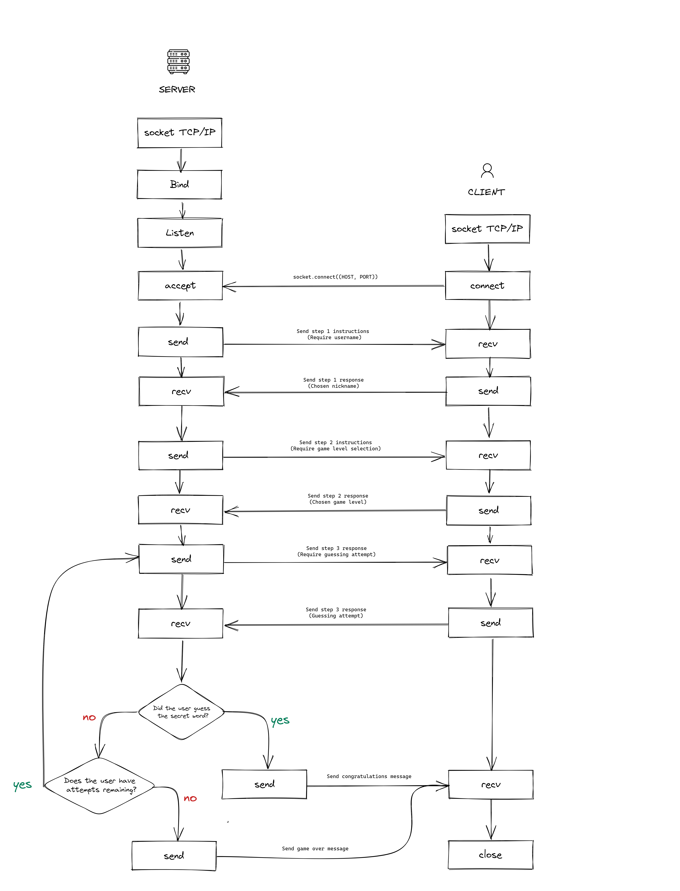

# Wordle 
Trata-se da implementação do **<span style="color:green">W</span><span style="color:yellow">o</span>r<span style="color:green">d</span><span style="color:yellow">l</span>e**, um jogo de advinhação de palavras, utilizando o Socket TCP. Este projeto representa a atividade prática sobre a Camada de Transporte realizada na disciplina 'CET098 - Rede de Computadores I' no semestre 2022.2. 

Nesta implementação, o servidor escolhe uma palavra secreta aleatória de cinco letras da língua portuguesa, enquanto o cliente deve tentar adivinhá-la, restrito a 6 tentativas. 

A lista de palavras utilizadas foi obtida no repositório de palavras do projeto [Dicionário br.ispell](https://www.ime.usp.br/~pf/dicios/).

## Demonstração
O jogo é executado em duas abas distintas do terminal, uma para o servidor e outra para o cliente.

### Execução do servidor
O servidor é inicializado e fica aguardando a conexão de um cliente. A estilização do terminal é feita com a biblioteca [Righ](https://github.com/Textualize/rich).


### Cliente jogando


### Feedback do servidor
No lado do servidor, há um feedback de cada ação realizada pelo cliente.



## 🚀 Executando o projeto

Para a execução do projeto, é necessário ter o Python instalado em sua máquina e pip, seu gerenciador de pacotes. Para isso, acesse o site oficial do Python e siga as instruções de instalação para o seu sistema operacional: https://www.python.org/downloads/.


#### Na pasta raiz do projeto, inicialize o ambiente virtual do Python

No Windows: 
```
py -m venv venv ; venv\Scripts\activate
```

Em distros Linux: 
```
python3 -m venv venv && source venv/bin/activate
```

#### Instalando as dependências:
```
pip install -r requirements.txt
```

#### Executando servidor e cliente:

Os processos do servidor e cliente devem ser executados em abas distintas do terminal, nesta ordem:

Servidor:
```
python3 server.py
``` 

Cliente:
```
python3 client.py
```

## Fluxo do protocolo


#### Sobre o estabelecimento da conexão
- Passo 1: Cria-se o objeto socket usando a função ```socket.socket()```. A função ```.socket()``` recebe como argumento a especificação do tipo de protocolo. Sendo ```socket.SOCK_STREAM``` para TCP ou ```socket.SOCK_DGRAM``` para UDP 

- Passo 2: O método ```.bind()``` é usado para associar um socket a uma conexão especifica e um número de porta específico 

- Passo 3: O método ```.listen()``` faz com que o server aceite conexões. Isso torna o serve um socket de "escuta".

- Passo 4 e 5: Do lado do cliente também é criado um socket com o ```.socket()```. No entanto, após a criação do socket o cliente deve chamar a função ```.connect()``` para estabelecer uma conexão com o server e iniciar uma via de mao dupla entre servidor <-> cliente. Esse passo é importante pois se assegura que cada lado da conexão é atingivél pela rede, em outras palavras isso significa que o cliente consegue acessar o servidor e vice-versa.

- Passo 5: Quando o cliente se conecta, o servidor chama ```.accept()``` para aceitar ou completar a conexão.

Após o estabelecimento da conexão transmissão de dados é feita através dos métodos ```.send()``` e ```.recv()```, que são usados para enviar e receber dados, respectivamente. As mensagens seguem o padrão que descrito no tópico seguinte.

### :memo: Padronização de mensagens

As mensagens trocadas entre o cliente e o servidor são realizadas através de dicionários em formato JSON. Para que a mensagem seja transmitida através do socket, os dicionários são convertidos em bytestreams, com uso da função ```pickle.dumps()```.

#### Mensagens do cliente para o servidor

- **Seleção de nickname**

```python
{
  'type': 'nickname_selection'
  'content': nickname
}
```

- **Escolha do nível de dificuldade**

```python
{
  'type': 'difficulty_selection'
  'content': selected_difficulty
}
``` 

- **Tentativa de adivinhar a palavra**

```python
{
  'type': 'guess'
  'content': guessed_word
}
```


#### Mensagens do servidor para o cliente

- **Seleção de nickname**

```python
{
  'type': 'nickname_selection',
  'content': 'Escolha um nickname para começar a jogar!'
}
```

- **Escolha do nível de dificuldade**

```python
{
  'type': 'difficulty_selection',
  'content': 'Selecione o nível de dificuldade',
  'options': ['Médio', 'Difícil']
}
``` 

- **Tentativa de adivinhar a palavra**

```python
{
  'secret_word': client_game.secret_word,
  'type': 'guess',
  'content': 'Adivinhe a palavra',
  'board': client_game.show()
}
```

- **Resultado da tentativa de adivinhação**

```python
{
  'type': 'guess_result',
  'content': result,
  'board': board,
  'secret_word': client_game.secret_word,
}
```


## Discentes
<ul>
  <li>
    <a href="https://github.com/gabriellerosa" target="_blank">
      Gabrielle Rosa :pouting_cat:
    </a>
  </li>
  <li>
    <a href="https://github.com/danieljcksn" target="_blank">
      Daniel Jackson :trollface:
    </a>
  </li>
</ul>
